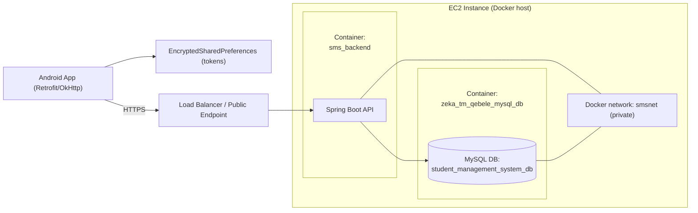

# Student Management System — Full-Stack Overview

A production-minded, full-stack system for managing students, teachers, classes and related metadata. This overview repo documents the architecture, security model, infrastructure, and how the mobile client and backend work together.

> Code lives in separate repositories:
>
> * **Android Client (Java 17):** *link to Android repo*
> * **Backend API (Spring Boot):** *link to backend repo*
>
> This repo is the **home for docs**, diagrams, and project coordination.

---

## Tech & Versions at a Glance

**Build tools:** Android uses **Gradle**; Backend uses **Maven**.

**Languages**

* Java **17** (Android & Backend)

**Android (Gradle)**

* Gradle **8.7**, Android Gradle Plugin **8.6.0**
* SDKs: `compileSdk` **35**, `targetSdk` **35**, `minSdk` **25**
* Networking: Retrofit **2.9.0**, OkHttp (BOM) **4.12.0**, Gson converter **2.9.0**
* Security: `androidx.security:security-crypto` **1.1.0-alpha06** (EncryptedSharedPreferences), JJWT **0.12.3**
* UI libs: Material **1.12.0**, AppCompat **1.6.1**, ConstraintLayout **2.1.4**, Navigation **2.4.1**
* Other: Flexbox **3.0.0**, CircleImageView **3.1.0**

**Backend (Maven)**

* Spring Boot **3.x** (Java 17), Hibernate/JPA
* Database: **MySQL 8.x**
* Containerization: **Docker** / docker-compose
* Cloud: **AWS EC2**, **IAM**, **Secrets Manager**

---

## What’s inside (high level)

* **Android app (Java 17):** Retrofit/OkHttp, encrypted token storage (**EncryptedSharedPreferences**), auto token refresh, view binding, custom adapters/widgets; Gradle JDK and `compileOptions` aligned to **Java 17**.
* **Backend REST API (Spring Boot 3):** clean layered design, stateless JWT auth (short-lived **access** + rotating **refresh**), CRUD for users/students/teachers and reference data, consistent `ApiError`.
* **Infrastructure:** containerized services with **Docker**; runs **locally** and in **AWS EC2**; hardened SSH/IAM; secrets outside of VCS; smooth dev→prod parity.
* **Observability & ops:** structured logs, health/readiness endpoints; ready to plug into ALB/NGINX/CloudWatch.

---

## Architecture

### EC2 topology (production)

* **Two containers on one EC2 instance**, joined to a private Docker network **`smsnet`**:

  * `sms_backend` (Spring Boot)
  * `zeka_tm_qebele_mysql_db` (MySQL)
* The backend reaches the DB **by container name over `smsnet`**; port 3306 is **not** exposed publicly.
* Secrets (DB URL/user/pass, JWT secret) come from **AWS Secrets Manager** via an **IAM instance role**.

### Local topology (development)

* Run the backend **from IntelliJ** or with Docker.
* **When running from IntelliJ**, Spring reads DB/JWT credentials from the **Run/Debug Configurations → Environment Variables** (mirrors prod names).
* Android points its `BASE_URL` to the local/dev API.

---

## Authentication & Token Flow

* Login returns **JWT access token** (short TTL) + **refresh token** (rotated on use and stored hashed server-side).
* Android adds `Authorization: Bearer <access>` on every call.
* On **401**, an OkHttp **Authenticator**:

    <ol type="1">
      <li>Calls <code>/auth/refresh.</code></li>
      <li>Saves the rotated pair.</li>
      <li><strong>Retries once.</strong></li>
      <li>On failure emits a <strong>single</strong> “session expired” event and routes to Login.</li>
    </ol>

This keeps the API **stateless**, secure, and user-friendly.

---

## Android Client Highlights

* **Language level:** Java 17 (`compileOptions { sourceCompatibility/targetCompatibility = JavaVersion.VERSION_17 }`).
* **Networking:** Retrofit + OkHttp (BOM-pinned), `AuthInterceptor` for bearer header, `TokenAuthenticator` for refresh.
* **Secure storage:** `TokenStore` using **EncryptedSharedPreferences** with safe migration from legacy plaintext.
* **Session hygiene:** `SessionManager` debounces duplicate expiry toasts; `LogoutManager` clears caches + tokens; managers for `Student/Teacher` “self” endpoints with lightweight in-memory caching.
* **UI/UX building blocks:** `CustomSpinner` (open/close events & dismiss), reusable detail adapters with update/delete actions, styled navigation drawer with selection persistence.

---

## Backend (at a glance)

* REST endpoints for **auth**, **users**, **students**, **teachers**, and taxonomies (categories, groups, sections, numbers/letters, languages, etc.).
* Admin APIs are rooted under /admin/** (e.g., /admin/admins and additional admin-managed resources).
* **JWT** issuance/verification; **refresh** rotates tokens; role gates (`/admin/**`, `/user/**`, `/auth/**`).
* **12-factor friendly:** config via env vars; stateless services; container-ready; clean exception advice returning `ApiError`.
* DB: MySQL 8 (dialect configurable).

> See the backend repo for domain model, schema, and full endpoint docs.

---

## Security Posture

* **Access/refresh split** with **short access TTL** and **rotating, hashed refresh tokens**.
* **On-device encryption** for tokens on Android.
* **Least-privilege IAM** (instance role scoped to a single Secrets Manager secret/region).
* **Hardened EC2:** only 80/443 exposed via ALB/NGINX; SSH locked down or via SSM; DB remains private on `smsnet`.
* **HTTPS everywhere in prod**; no secrets in Git; reproducible images.

---

## Containerization & Deployment

* **Local:** `docker compose up` in the backend repo to start API + DB; or run API from IntelliJ with env vars set.
* **Production on EC2:**

    <ol type="1">
      <li>Create Docker network <code>smsnet</code>.</li>
      <li>Run <strong>MySQL</strong> container with a persistent volume on <code>smsnet</code>.</li>
      <li>Attach an <strong>IAM role</strong> to EC2 that can read the backend’s secret in <strong>Secrets Manager</strong>.</li>
      <li>Start <code>sms_backend</code> (Spring Boot 3, Java 17) and join <code>smsnet</code>; export secrets as env vars at container start.</li>
      <li>Put <strong>ALB/NGINX</strong> in front; terminate TLS; forward to backend.</li>
    </ol>

---

## Local Development (quick start)

1. **Backend**

   * **IntelliJ:** set `db_sms_url`, `db_sms_username`, `db_sms_password`, `sms_app_secret` in **Run/Debug → Environment Variables** and run.
   * **Docker:** spin up DB+API with compose; same env names as prod.
2. **Android**

   * Open the Android repo in Android Studio.
   * Ensure **Gradle JDK = 17**.
   * Set `BASE_URL` in your Retrofit config to the dev/prod endpoint.
   * Run on emulator/device.

> In production, always use **HTTPS** and a public hostname.

---

## Project Goals

* Demonstrate **secure session management** on mobile with a robust refresh flow.
* Showcase **clean API layering** and **reusable UI** patterns on Android.
* Apply **containerization** and **AWS fundamentals** (EC2, IAM, Secrets Manager, networking) for realistic deployment.
* Keep the system **observable, secure, and maintainable**.

---

## Roadmap

* IaC (Terraform) for EC2/IAM/Secrets.
* CI/CD (build, scan, push, deploy).
* Centralized logging/metrics (CloudWatch/OpenSearch/Grafana); tighter ALB/WAF rules.
* More automated tests (mobile & backend auth flows).

---

## License

(MIT/Apache-2.0).

---
